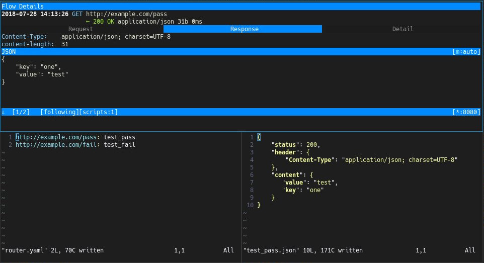

# mitm-scripts

> A collection of some handy [mitmproxy](https://github.com/mitmproxy/mitmproxy) inline scripts.

## Table of Contents

- [Precondition](#precondition)
- [List of Scripts](#list-of-scripts)
  - [mitm-rewrite](#mitm-rewrite)
  - [mitm-replace](#mitm-replace)
  - [mitm-redirect-host](#mitm-redirect-host)
  - [mitm-redirect-url](#mitm-redirect-url)
  - [mitm-delay-request](#mitm-delay-request)
  - [mitm-kill-request](#mitm-kill-request)
  - [mitm-show-header](#mitm-show-header)
  - [mitm-check-analytics](#mitm-check-analytics)
  - [mitm-dump-curl](#mitm-dump-curl)
  - [mitm-record](#mitm-record)
  - [mitm-random-outage](#mitm-random-outage)

## Precondition

1. Install [mitmproxy](https://docs.mitmproxy.org/stable/overview-installation/)

2. [Configure client browser or device](https://docs.mitmproxy.org/stable/overview-getting-started/#configure-your-browser-or-device): configure proxy settings and install CA on client.

## List of Scripts

- [mitm-rewrite](#mitm-rewrite): ./mitm-rewrite.py, ./rewrite-router.yaml
- [mitm-replace](#mitm-replace): ./mitm-replace.py, ./replace-router.yaml
- [mitm-redirect-host](#mitm-redirect-host): ./mitm-redirect-host.py, ./redirect-request.yaml
- [mitm-redirect-url](#mitm-redirect-url): ./mitm-redirect-url.py, ./redirect-request.yaml
- [mitm-delay-request](#mitm-delay-request): ./mitm-delay-request.py, ./delay-request.yaml
- [mitm-kill-request](#mitm-kill-request): ./mitm-kill-request.py, ./kill-request.yaml
- [mitm-show-header](#mitm-show-header): ./mitm-show-header.py, ./show-header.yaml
- [mitm-check-analytics](#mitm-check-analytics): ./mitm-check-analytics.py, ./check-analytics.yaml
- [mitm-dump-curl](#mitm-dump-curl): ./mitm-dump-curl.py, ./dump-curl.yaml
- [mitm-record](#mitm-record): ./mitm-record.py, ./record-request.yaml
- [mitm-random-outage](#mitm-random-outage): ./mitm-random-outage.py

All the scripts above can be used with `mitmproxy` and `mitmdump` command:

```bash
~$ mitmproxy -s <script-name>.py
```

OR

```bash
~$ mitmdump -s <script-name>.py
```

### mitm-rewrite

`./mitm-rewrite.py` can return mock JSON response for certain target URLs.

1. Run `mitmdump`:

```bash
~$ mitmdump -s mitm-rewrite.py
```

2. Check `rewrite-router.yaml`, to link response JSON file, for e.g:

```yaml
http://example.com/pass: test_pass
http://example.com/fail: test_fail
```

It means that the response of "http://exmaple.com/pass" will be overwritten by the content in `./response/test_pass.json` file and the response of "http://exmaple.com/fail" will be overwritten by the content in `./response/test_fail.json` file.

3. Edit response JSON file to put mock data you want:

```json
{
  "status": 200,
  "header": { ... },
  "content": ...
}
```

- status: http status code, an INT number
- header: http response headers
- content: response body

The changes in router yaml file and json response files will be applied **on the fly**, no need to restart proxy. Here is an example how it looks like:



**[`^ back to top ^`](#mitm-scripts)**

---

### mitm-replace

`./mitm-replace.py` can replace the specific string to another one. `replace-router.yaml` is used to link URL and yaml file in `response` folder. In the response yaml file, the matching string and result strings can be defined as a pair. Don't forget to uncomment URLs in `replace-router.yaml` and make it work on the fly!

```
~$ mitmdump -s mitm-replace.py
```

**[`^ back to top ^`](#mitm-scripts)**

---

### mitm-redirect-host

`./mitm-redirect-host.py` can redirect the request **host** of URL request to another host. The matching URL and redirect host can be defined in `redirect-requenst.yaml`. Attention: only the host part of request URL will be replaced.

```bash
~$ mitmdump -s mitm-redirect-host.py
```

**[`^ back to top ^`](#mitm-scripts)**

---

### mitm-redirect-url

`./mitm-redirect-url.py` can redirect the whole request to another URL. The matching URL and redirect URL can be defined in `redirect-request.yaml`.

```bash
~$ mitmdump -s mitm-redirect-url.py
```

**[`^ back to top ^`](#mitm-scripts)**

---

### mitm-delay-request

`./mitm-delay-request.py` can delay HTTP/HTTPS request time and response time, in order to simulate the slow network. To configure matching URL and delay time, edit `delay-request.yaml`.

```bash
~$ mitmdump -s mitm-delay-request.py
```

**[`^ back to top ^`](#mitm-scripts)**

---

### mitm-kill-request

`./mitm-kill-request.py` can kill all matching requests. The matching request methods and URls can be defined in `kill-request.yaml`.

```bash
~$ mitmdump -s mitm-kill-request.py
```

**[`^ back to top ^`](#mitm-scripts)**

---

### mitm-show-header

`./mitm-show-header.py` can print out matched request header and response header, with its value. The matching URL and header can be defined in `show-header.yaml`.

```bash
~$ mitmdump -s mitm-show-header.py | grep '>>\|->'
```

**[`^ back to top ^`](#mitm-scripts)**

---

### mitm-check-analytics

`./mitm-check-analytics.py` can display real-time analytics key and value, in order to help checking analytics efficiently. To configure URL and keywords, edit `check-analytics.yaml`.

1. Run mitmdump:

```bash
~$ mitmdump -s mitm-check_analytics.py
```

2. Visit target web page in clients: browsers or apps. The matched analytics keyword and value will show up in terminal.

**[`^ back to top ^`](#mitm-scripts)**

---

### mitm-dump-curl

`./mitm-dump-curl` can find matching request URL and dump the request to a file in as cURL format. The matching URL and dump folder can be defined in `dump-curl.yaml`.

```bash
~$ mitmdump -s mitm-dump-curl.py
```

**[`^ back to top ^`](#mitm-scripts)**

---

### mitm-record

`./mitm-record.py` can save matching request details (request headers, request body, response headers and response body) to a specific file. The matching URl and dump folder can be defined in `record-request.yaml`.

```bash
~$ mitmdump -s mitm-record.py
```

**[`^ back to top ^`](#mitm-scripts)**

---

### mitm-random-outage

`./mitm-random-outage.py` can simulate sever outage and return 503 code. It will pick randomly the requests to make it 503. The percentage of outage can be changed as the variable `percentage` inside the script.

```bash
~$ mitmdump -s mitm-random-outage.py
```

**[`^ back to top ^`](#mitm-scripts)**
